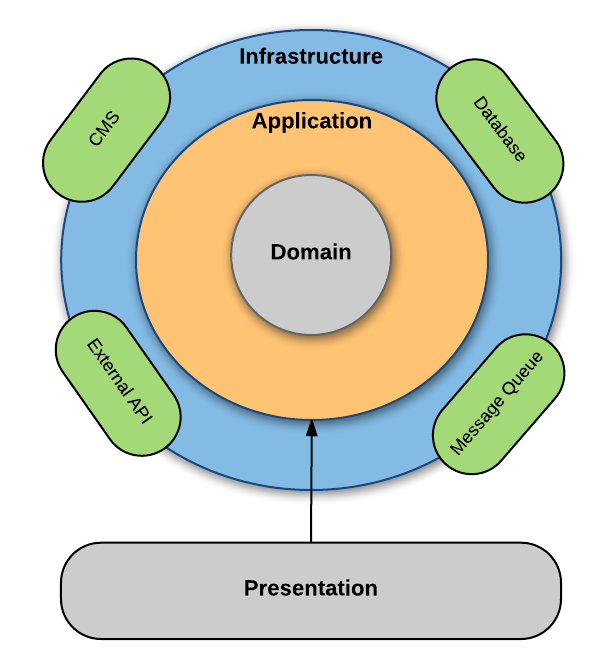
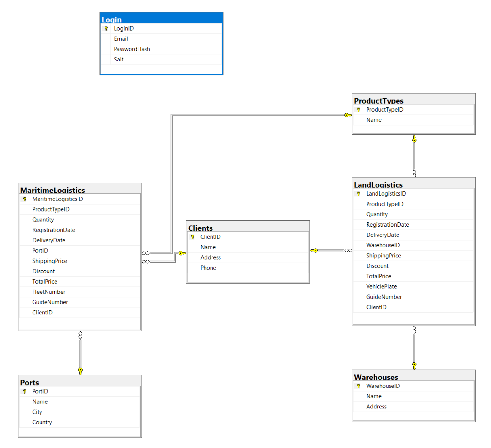

# TEST-ANGULAR-NET-01 Logistica

Proyecto CRUD de logística marítima y terrestre, para prueba técnica.

## Tecnologias

### Backend

- .NET 6
- Entity Framework Core 6
- Linq
- C#

### Base de datos

- MS SQL Express 2019 (Script es compatible para versiones 2012 en adelante)

### Frontend

- Angular 15
- Angular Material
- HTML
- SCSS
- Typescript

## Arquitecturas

### Comunicación Backend-Frontend

- REST, Es un enfoque para diseñar servicios web y sistemas distribuidos. Se basa en la comunicación cliente-servidor utilizando el protocolo HTTP. Utiliza operaciones CRUD y se enfoca en la simplicidad, escalabilidad y la interoperabilidad a través de estándares web.

- Se ha seguido el principio OpenAPI en la construcción de los endpoints.

### Backend

- Hexagonal busca separar y aislar el dominio del sistema de su infraestructura técnica. En esta arquitectura, el núcleo del negocio, es decir, el dominio, se sitúa en el centro, rodeado por diferentes capas externas que se encargan de la comunicación con el mundo exterior. Se utilizó la metodología DDD  (Domain-Driven Design).

Las capas principales en la arquitectura de DDD son:

1. Capa de Dominio: Contiene la lógica de negocio, reglas y conceptos clave del dominio. Aquí se modelan las entidades, agregados y servicios del negocio.

2. Capa de Infraestructura: Proporciona las implementaciones técnicas necesarias para persistir y recuperar datos, interactuar con servicios externos, y manejar aspectos de infraestructura como el acceso a bases de datos, la autenticación, la seguridad, entre otros.

3. Capa de Aplicación: Actúa como el puente entre la capa de dominio y la capa de presentación. Coordina las interacciones entre los componentes de dominio y las interfaces de usuario, maneja flujos de trabajo y orquesta las operaciones del sistema.

4. Capa de Presentación: Es la interfaz de usuario o el punto de entrada para los usuarios finales. Puede ser una interfaz web, una aplicación móvil u otras formas de interacción. Esta capa se centra en la presentación de la información y la interacción con el usuario, sin contener lógica de negocio compleja. En este enfoque, la Web API actúa como la capa de presentación del sistema, ya que se encarga de recibir las solicitudes HTTP de los clientes (como navegadores web, aplicaciones móviles, u otros sistemas) y enviar las respuestas correspondientes. 

PD: Por temas de tiempo no está del todo correcto implementado.

### Frontend

- MVC, en Angular separa la aplicación en tres componentes principales: el modelo (Model), la vista (View) y el controlador (Controller) (tambien se puede llamar Component en este caso). El modelo representa los datos y la lógica de negocio, la vista es la interfaz de usuario y el controlador o componente se encarga de coordinar la interacción entre el modelo y la vista. Esta arquitectura facilita la organización del código y mejora la reutilización de componentes en la aplicación.

## Diagrama Entidad Relación

## Patrones de Diseño utilizados

### Backend
- El patrón Repositorio, separa la lógica de negocio de los detalles de persistencia de datos. 

### Frontend
- El patrón Observador, se utiliza Observables para establecer comunicación entre componentes y servicios, permitiendo suscribirse a cambios en los datos y reaccionar de forma reactiva.

- El patrón Fachada, proporciona una interfaz simplificada para interactuar con un sistema complejo o conjunto de clases. Actúa como una capa de abstracción que oculta la complejidad subyacente y proporciona una interfaz más fácil de usar y entender. Aunque implementado de forma muy sencilla actualmente, se puede observar en el consumo de un servicio que gestiona nuestra logica de negocio en el frontend y este servicio consume otro servicio que se dedica a las peticiones http.

## Buenas prácticas

### Principios SOLID

Se ha procurado utilizar los principios SOLID en el desarrollo del backend y frontend, los principios SOLID son:

- Principio de responsabilidad única (SRP): Cada clase debe tener una única responsabilidad. Esto se puede evidenciar en el backend en la separación de las responsabilidades en capas y en clases; y en el frontend en la separación de las responsabilidades de los servicios.

- Principio de abierto/cerrado (OCP): Las entidades deben estar abiertas para su extensión pero cerradas para su modificación. Por tiempo, esto se pudo haber implementado en la gestion logistica, ya que logistica terrestre y maritima ambos obedecerian a una superclase logistica.

- Principio de sustitución de Liskov (LSP): Los objetos de una clase base deben poder ser reemplazados por objetos de sus clases derivadas sin afectar la funcionalidad esperada. Por tiempo, esto se pudo haber implementado en la gestion logistica.

- Principio de segregación de interfaces (ISP): Los clientes no deben depender de interfaces que no utilizan. Aunque no lo he implementado por tiempo, este principio se puede observar al momento de que un componente implemente el onInit en angular, u otra interface del ciclo de vida de un componente a medida que se requiera.

- Principio de inversión de dependencia (DIP): Los módulos de alto nivel no deben depender de módulos de bajo nivel, ambos deben depender de abstracciones. Esto se puede evidenciar en el backend en la implementación del patron repositorio y el dbcontext, al cambiar de gestor de base de datos es posible que se genere pequeños cambios en el repositorio y en el dbcontext pero esto no afectará las clases que consuman los repositorios.